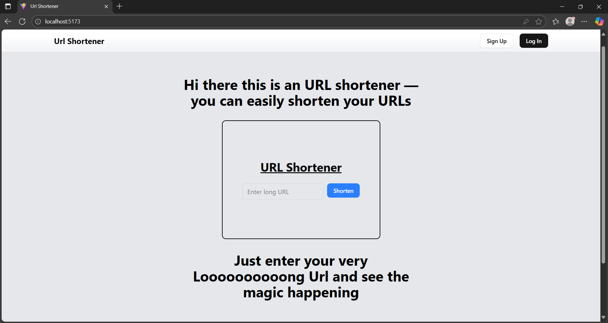

<u><strong>Application:</strong></u>
URL Shortener built using the MERN stack (MongoDB, Express, React, Node.js).

<u><strong>User Roles:</strong></u>

    Normal User: Can log in and view their own collection of shortened URLs on their dashboard.

    Admin User: Has additional privileges to view all URLs in the system.

<u><strong>Dashboard Features:</strong></u>

    Logged-in users see their own URL collection.

    Admins can access routes showing all URLs visited across users.

    Admin dashboard displays count of times each shortened URL has been visited.

<u><strong>Functionality:</strong></u>

    User authentication and role-based access control.

    URL shortening and storage per user.

    Tracking and counting URL visits.

    Separate views for normal users vs. admin.